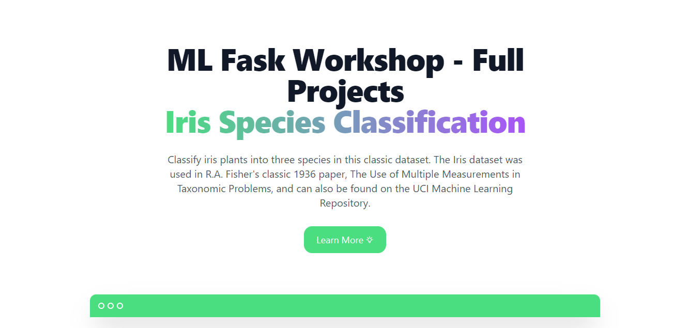

#   Welcome to Deploy ML/AI model with Flask


#   To follow along with the Presentation, clone this repository.

```bash
    git clone <https-url>
```
>   With that you will have access to the starter code and you can follow along with the recording.

#   Watch the recording by clicking the image below.
[](https://tldv.io/app/meetings/630a409bb6e9980014708458/)

## Check out this url for what you will be able to build following the recording (No CSS full functioning deployed ML) [](https://ml-workshop.herokuapp.com/) 

##  Full code of live coding session goes here [ml-workshop](https://github.com/Taiwrash/machine-learning-ai-deployment-with-flask-workshop/tree/live-coding)

## Check out this instead to see complete design at main branch of this repo [demo here](https://ml-ai-flask.herokuapp.com/)

## Full code of the target, click the picture 

[](https://github.com/Taiwrash/machine-learning-ai-deployment-with-flask-workshop/tree/main)


#   Give us a star :star: :star: we love it.

#   Thanks for coming,

# Drop us a follow on social.

### Author Socials

-   [GitHub @Taiwrash](https://github.com/Taiwrash)
-   [Twitter @Ibn_mudathir](https://twitter.com/Ibn_mudathir)
-   [Linkedin @Rasheed Mudasiru](https://linkedin.com/in/rasheedtaiwo)
